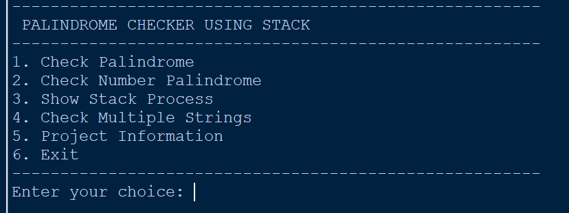
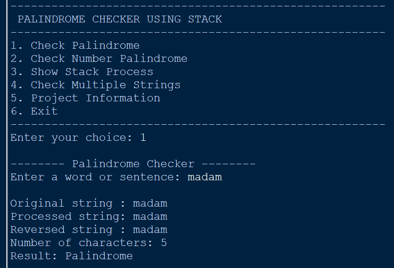
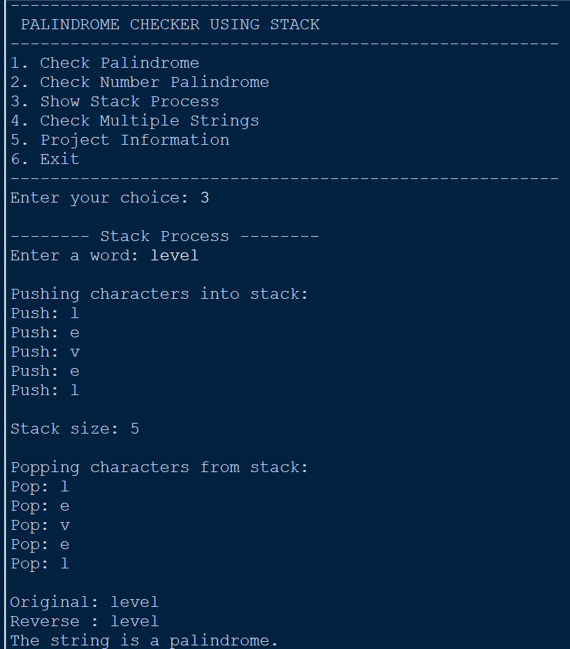
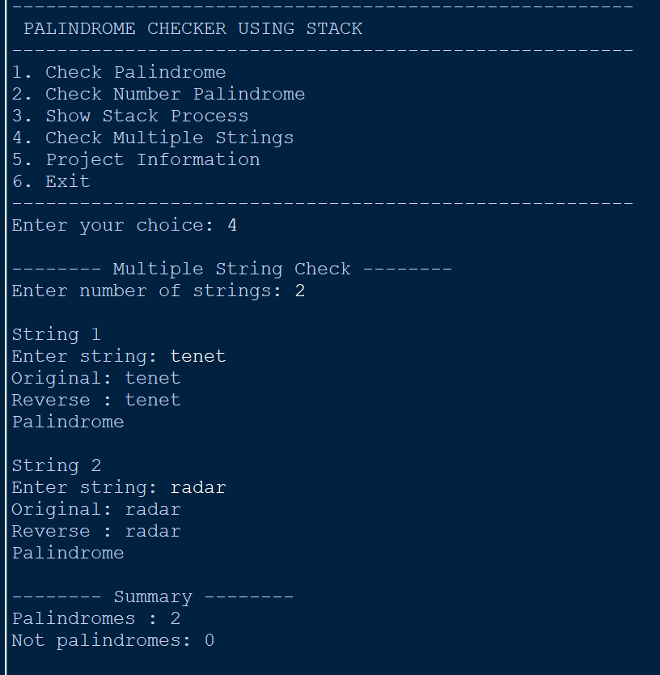

# Palindrome Checker Using Stack

A Python program that checks whether words, sentences, and numbers are palindromes using a Stack.

## Features

- Check whether a word or sentence is a palindrome
- Check number palindromes
- Display the stack push and pop process
- Check multiple strings
- Display project information
- Input validation

## Concepts Used

- Stack
- LIFO (Last In, First Out)
- Push operation
- Pop operation
- Stack size
- Empty stack checking

## Technologies Used

- Python
- Stack Data Structure

## How It Works

The program uses a Stack to reverse the entered string.

Characters are pushed into the stack one by one. Since a stack follows the LIFO principle, the characters are popped in reverse order.

The reversed string is then compared with the original processed string. If both are the same, the string is identified as a palindrome.

The program also provides a stack process option that shows each push and pop operation.

## Menu Options

1. Check Palindrome
2. Check Number Palindrome
3. Show Stack Process
4. Check Multiple Strings
5. Project Information
6. Exit

## Screenshots

### Main Menu

### Palindrome Check

### Stack Process

### Multiple String Check

## Files

- `palindrome_checker_using_stack.py` – Main Python program.
- `main_menu.png` – Main menu screenshot.
- `check_palindrome.png` – Palindrome checking output.
- `stack_process.png` – Stack push and pop process.
- `multiple_strings.png` – Multiple string checking output.
